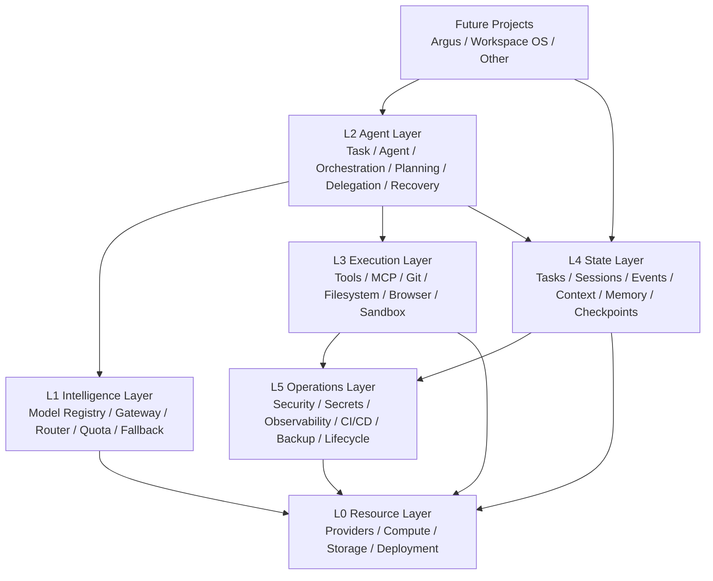

# System Map

## Logical layers



## Core invariant

The project layer must not directly depend on provider-specific resources.

```text
Project
  ↓
Infrastructure contracts
  ↓
Adapters
  ↓
External resources
```

The inverse dependency is prohibited.

## Runtime execution path

```text
Task
 ↓
Coordinator / Agent Runtime
 ↓
Context Manager
 ↓
Model Gateway
 ↓
Router
 ↓
Provider / Model
 ↓
Model decision
 ↓
Permission Engine
 ↓
Sandbox
 ↓
Tool
 ↓
External effect
 ↓
Observation
 ↓
State + Event Store
 ↓
Verification
 ↓
Checkpoint / Recovery / Completion
```
